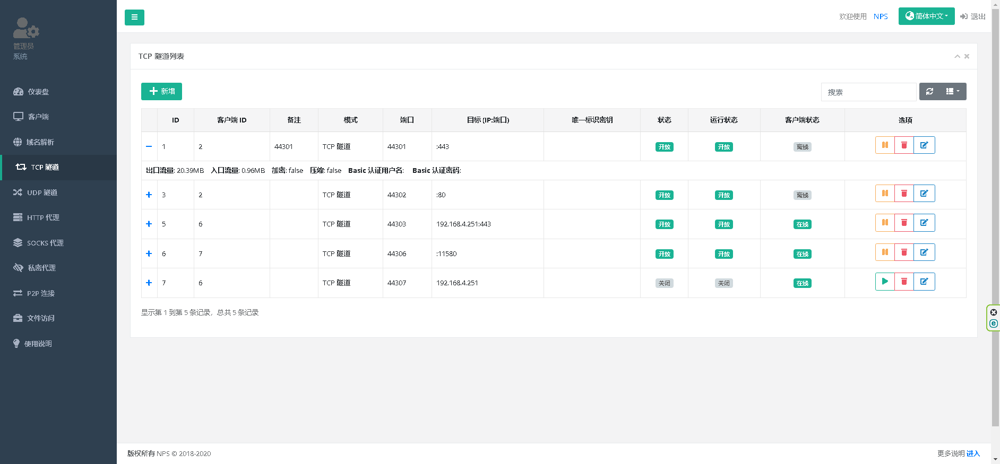

### 服务端安装docker 
```
wget https://minio.sxxpqp.top/docker/install-docker.sh
chmod +x install-docker.sh
./install-docker.sh
```
### 服务端启动docker
```
systemctl start docker
systemctl enable docker
```
### 服务端更新docker 镜像源 添加或者更改
```
vi /etc/docker/daemon.json
```
```
{
  "registry-mirrors": ["https://dockerhub.sxxpqp.top"]
}
```
### 服务端重启docker
```
systemctl restart docker
```

### 服务端安装nps
创建目录
```
mkdir -p /opt/nps/conf
```
创建配置文件
```
touch /opt/nps/conf/clients.json
touch /opt/nps/conf/tasks.json
touch /opt/nps/conf/hosts.json
```
创建nps.conf配置文件
```
cat >/opt/nps/conf/nps.conf<<EOF
appname = nps
#Boot mode(dev|pro)
runmode = dev

#HTTP(S) proxy port, no startup if empty
http_proxy_ip=0.0.0.0
http_proxy_port=80
https_proxy_port=443
https_just_proxy=true
#default https certificate setting
https_default_cert_file=conf/server.pem
https_default_key_file=conf/server.key

##bridge
bridge_type=tcp
bridge_port=8024
bridge_ip=0.0.0.0

# Public password, which clients can use to connect to the server
# After the connection, the server will be able to open relevant ports and parse related domain names according to its own configuration file.
public_vkey=123

#Traffic data persistence interval(minute)
#Ignorance means no persistence
#flow_store_interval=1

# log level LevelEmergency->0  LevelAlert->1 LevelCritical->2 LevelError->3 LevelWarning->4 LevelNotice->5 LevelInformational->6 LevelDebug->7
log_level=7
#log_path=nps.log

#Whether to restrict IP access, true or false or ignore
#ip_limit=true

#p2p
#p2p_ip=127.0.0.1
#p2p_port=6000

#web
web_host=a.o.com
web_username=admin
web_password=123
web_port = 8080
web_ip=0.0.0.0
web_base_url=
web_open_ssl=false
web_cert_file=conf/server.pem
web_key_file=conf/server.key
# if web under proxy use sub path. like http://host/nps need this.
#web_base_url=/nps

#Web API unauthenticated IP address(the len of auth_crypt_key must be 16)
#Remove comments if needed
#auth_key=test
auth_crypt_key =1234567812345678

#allow_ports=9001-9009,10001,11000-12000

#Web management multi-user login
allow_user_login=false
allow_user_register=false
allow_user_change_username=false


#extension
allow_flow_limit=false
allow_rate_limit=false
allow_tunnel_num_limit=false
allow_local_proxy=false
allow_connection_num_limit=false
allow_multi_ip=false
system_info_display=false

#cache
http_cache=false
http_cache_length=100

#get origin ip
http_add_origin_header=false

#pprof debug options
#pprof_ip=0.0.0.0
#pprof_port=9999

#client disconnect timeout
disconnect_timeout=60
EOF
```


```bash
docker run -d --name=nps  --privileged --restart=always --net=host -v /opt/nps/conf:/conf sxxpqp/nps
```


### 访问nps
```
http://ip:8080
```
### 登录
```
用户名：admin
密码：123
```

### windows 客户端安装
访问npc https://minio.sxxpqp.top/nps/npc.exe 下载
```
https://minio.sxxpqp.top/nps/npc.exe
```
### npc.exe copy到C:/npc/npc.exe  （有杀毒和病毒防护需要加入隔离区）

### 在服务端生成客户端登录配置 （服务端操作后）

### 服务注册到win 注册表上去 xxxx修改自己ip xxx修改自己的vkey
```
sc create npc binPath= "C:\npc\npc.exe -server=XXXX:8024 -vkey=XXX -type=tcp"
sc start npc
sc config npc start= auto
sc qc npc
```

### 在服务端配置tcp代理即可 （服务端操作后）


### 服务端防火墙和云上防护墙需要开启相对应端口
